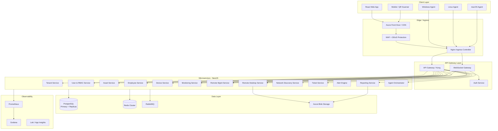
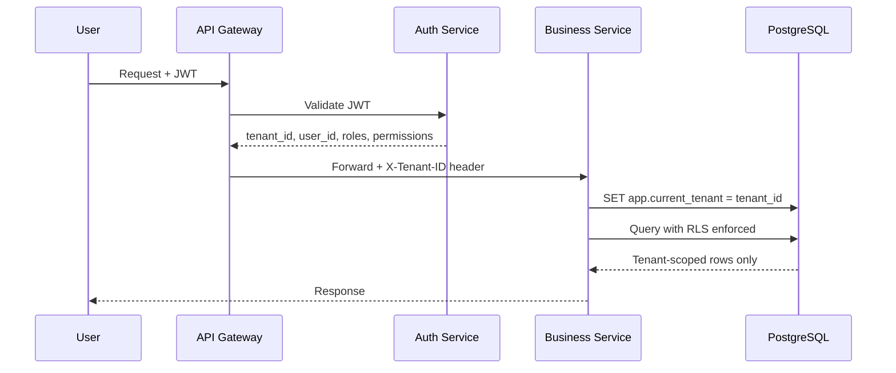
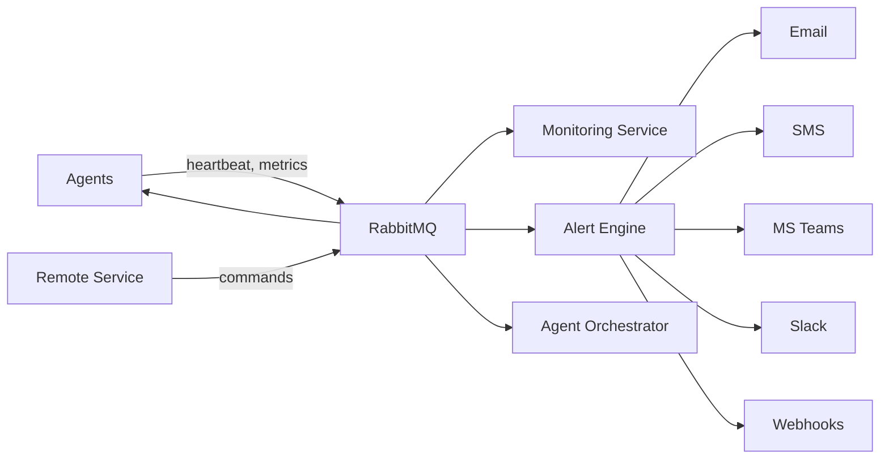
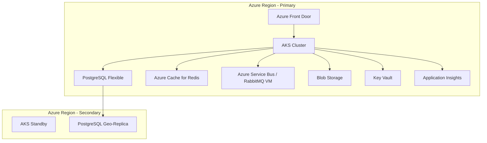

# System Architecture

## 1. High-Level Architecture Diagram



---

## 2. Multi-Tenant Architecture

### Tenant Isolation Strategy: **Shared Database, Shared Schema, Row-Level Security (RLS)**

| Approach | Pros | Cons | Decision |
|----------|------|------|----------|
| DB per tenant | Strong isolation | Cost, ops complexity | ❌ Enterprise tier option only |
| Schema per tenant | Good isolation | Migration overhead | ❌ |
| **RLS + tenant_id** | Cost-efficient, scalable | Requires discipline | ✅ **Primary** |

### Tenant Context Flow



### MSP Hierarchy

```
msp_parent_tenant_id → NULL (MSP root)
client tenants → msp_parent_tenant_id = MSP tenant UUID

MSP users can switch context to child tenants (with permission)
Child tenant users CANNOT see parent or sibling tenants
```

### Subscription & Usage Limits

Enforced at API middleware layer:

```typescript
interface TenantLimits {
  maxEndpoints: number;
  maxAdmins: number;
  maxNetworkDevices: number;
  features: FeatureFlag[];
  remoteDesktopMinutes: number;
}
```

Redis counters track real-time usage; nightly job reconciles with PostgreSQL.

---

## 3. Database Strategy

| Component | Strategy |
|-----------|----------|
| Primary DB | PostgreSQL 16 on Azure Flexible Server |
| Read replicas | 2× read replicas for reporting queries |
| Partitioning | `audit_logs`, `device_metrics` partitioned by month |
| Connection pooling | PgBouncer per service pod |
| Migrations | Flyway / TypeORM migrations, tenant-safe |
| Backups | PITR 35 days, geo-redundant |
| RLS | Every tenant-scoped table has `tenant_id` + policy |

---

## 4. Security Architecture (Summary)

See [Security Design](06-security-design.md) for full detail.

- **Identity:** JWT (15min access + 7d refresh), MFA (TOTP/WebAuthn)
- **Federation:** SAML 2.0, Entra ID OIDC, LDAP bind
- **Agent auth:** mTLS + device certificate per agent
- **Encryption:** TLS 1.3 in transit, AES-256 at rest (Azure TDE + app-level for secrets)
- **Zero Trust:** Every request authenticated + authorized; no implicit trust by network

---

## 5. Messaging Architecture



**Exchange topology:**
- `agent.telemetry` — metrics, inventory, heartbeats
- `agent.commands` — remote exec, script deploy
- `platform.events` — domain events (asset.created, ticket.escalated)
- `alerts.dispatch` — alert routing

---

## 6. Real-Time Layer (WebSocket)

| Channel | Purpose | Auth |
|---------|---------|--------|
| `/ws/agent` | Agent bidirectional comms | mTLS + agent token |
| `/ws/monitoring` | Live metric streams | JWT + tenant scope |
| `/ws/remote` | Command output streaming | JWT + device permission |
| `/ws/rdp` | Remote desktop signaling | JWT + session token |
| `/ws/notifications` | UI push (alerts, tickets) | JWT |

---

## 7. Scalability Targets

| Metric | Phase 1 | Phase 3 | Production |
|--------|---------|---------|------------|
| Tenants | 10 | 500 | 10,000+ |
| Agents | 0 | 50K | 1M+ |
| API req/s | 100 | 2,000 | 20,000 |
| Metrics ingest/s | 0 | 10K | 500K |

**Horizontal scaling:** Stateless NestJS pods behind K8s HPA; PostgreSQL vertical + read replicas; Redis cluster; RabbitMQ quorum queues.

---

## 8. Azure Deployment Topology



---

## 9. Phase 1 Demo Architecture (Simplified)

For the initial demo, deploy as a **modular monolith** rather than full microservices:

```
┌─────────────────────────────────────────┐
│  React SPA (Material UI)                │
└─────────────────┬───────────────────────┘
                  │ HTTPS / REST
┌─────────────────▼───────────────────────┐
│  NestJS Monolith (modular)              │
│  ├── auth module                        │
│  ├── tenant module                      │
│  ├── asset module                       │
│  ├── employee module                    │
│  └── audit module                       │
└─────────────────┬───────────────────────┘
                  │
        ┌─────────┴─────────┐
        ▼                   ▼
   PostgreSQL            Redis
   (RLS enabled)      (sessions/cache)
```

**Rationale:** Faster demo delivery; extract services in Phase 2+ when agent traffic justifies it.
