# Database Schema

## ER Diagram (Core Platform)

```mermaid
erDiagram
    companies ||--o{ users : has
    companies ||--o{ subscription_plans : subscribes
    companies ||--o{ employees : employs
    companies ||--o{ departments : has
    companies ||--o{ assets : owns
    companies ||--o{ devices : manages
    companies ||--o{ agents : registers
    companies ||--o{ tickets : tracks
    companies ||--o{ alerts : receives
    companies ||--o{ network_devices : monitors
    companies ||--o{ vendors : uses
    companies ||--o{ licenses : holds

    users ||--o{ user_roles : has
    roles ||--o{ user_roles : assigned
    roles ||--o{ role_permissions : grants
    permissions ||--o{ role_permissions : includes

    employees ||--o{ departments : belongs
    employees ||--o{ asset_assignments : receives
    assets ||--o{ asset_assignments : assigned
    assets ||--o{ asset_ownership_history : tracks
    assets }o--|| vendors : purchased_from
    assets ||--o{ warranty_records : has
    assets ||--o{ purchase_records : has
    assets ||--o{ depreciation_records : depreciates

    devices ||--o| agents : runs
    devices ||--o{ software_inventory : contains
    devices ||--o{ device_metrics : emits
    devices ||--o{ device_services : runs

    tickets ||--o{ ticket_comments : has
    tickets ||--o{ ticket_sla_events : tracks
    tickets }o--|| users : assigned_to

    alerts }o--|| alert_rules : triggered_by
    network_devices ||--o{ network_device_metrics : emits

    users ||--o{ audit_logs : performs
    assets ||--o{ audit_logs : subject
```



---

## Multi-Tenant Conventions

Every tenant-scoped table includes:

```sql
tenant_id UUID NOT NULL REFERENCES companies(id),
created_at TIMESTAMPTZ NOT NULL DEFAULT NOW(),
updated_at TIMESTAMPTZ NOT NULL DEFAULT NOW(),
created_by UUID REFERENCES users(id),
updated_by UUID REFERENCES users(id),
deleted_at TIMESTAMPTZ  -- soft delete
```

**RLS policy template:**

```sql
ALTER TABLE assets ENABLE ROW LEVEL SECURITY;
CREATE POLICY tenant_isolation ON assets
  USING (tenant_id = current_setting('app.current_tenant')::UUID);
```

---

## Core Tables (Phase 1 — Demo)

### companies (tenants)

| Column | Type | Notes |
|--------|------|-------|
| id | UUID PK | |
| name | VARCHAR(255) | Company display name |
| slug | VARCHAR(100) UNIQUE | URL subdomain |
| msp_parent_id | UUID FK | NULL for direct tenants |
| status | ENUM | active, suspended, trial |
| subscription_plan_id | UUID FK | |
| settings | JSONB | Branding, locale, timezone |
| trial_ends_at | TIMESTAMPTZ | |

### users

| Column | Type | Notes |
|--------|------|-------|
| id | UUID PK | |
| tenant_id | UUID FK | |
| email | VARCHAR(255) | Unique per tenant |
| password_hash | VARCHAR(255) | NULL if SSO-only |
| first_name, last_name | VARCHAR(100) | |
| status | ENUM | active, inactive, locked |
| mfa_enabled | BOOLEAN | |
| mfa_secret | VARCHAR(255) | Encrypted |
| last_login_at | TIMESTAMPTZ | |
| auth_provider | ENUM | local, ldap, saml, entra |

### roles / permissions / user_roles / role_permissions

Standard RBAC. System roles: `super_admin`, `tenant_admin`, `it_admin`, `helpdesk`, `viewer`.

### employees

| Column | Type | Notes |
|--------|------|-------|
| id | UUID PK | |
| tenant_id | UUID FK | |
| employee_number | VARCHAR(50) | |
| email | VARCHAR(255) | |
| department_id | UUID FK | |
| manager_id | UUID FK | Self-ref |
| status | ENUM | active, terminated, on_leave |
| hire_date | DATE | |
| termination_date | DATE | |

### departments

| Column | Type | Notes |
|--------|------|-------|
| id | UUID PK | |
| tenant_id | UUID FK | |
| name | VARCHAR(255) | |
| parent_id | UUID FK | Hierarchy |
| cost_center | VARCHAR(50) | |

### assets

| Column | Type | Notes |
|--------|------|-------|
| id | UUID PK | |
| tenant_id | UUID FK | |
| asset_tag | VARCHAR(100) | Unique per tenant |
| name | VARCHAR(255) | |
| category | ENUM | laptop, desktop, server, mobile, peripheral, network, other |
| manufacturer | VARCHAR(255) | |
| model | VARCHAR(255) | |
| serial_number | VARCHAR(255) | |
| status | ENUM | in_stock, deployed, in_repair, retired, lost, disposed |
| lifecycle_stage | ENUM | procurement, active, maintenance, end_of_life |
| purchase_date | DATE | |
| purchase_cost | DECIMAL(12,2) | |
| current_value | DECIMAL(12,2) | Depreciated |
| location | VARCHAR(255) | |
| qr_code_data | VARCHAR(500) | Encoded lookup URL |
| vendor_id | UUID FK | |
| assigned_employee_id | UUID FK | Current assignee |
| warranty_expires_at | DATE | |
| notes | TEXT | |
| custom_fields | JSONB | Extensible |

### asset_assignments

| Column | Type | Notes |
|--------|------|-------|
| id | UUID PK | |
| tenant_id | UUID FK | |
| asset_id | UUID FK | |
| employee_id | UUID FK | |
| assigned_at | TIMESTAMPTZ | |
| returned_at | TIMESTAMPTZ | NULL if active |
| assigned_by | UUID FK users | |
| return_condition | TEXT | |
| notes | TEXT | |

### asset_ownership_history

Immutable log of status/ownership changes (trigger-populated).

### vendors

| Column | Type | Notes |
|--------|------|-------|
| id | UUID PK | |
| tenant_id | UUID FK | |
| name | VARCHAR(255) | |
| contact_email | VARCHAR(255) | |
| contact_phone | VARCHAR(50) | |
| website | VARCHAR(500) | |
| address | JSONB | |

### warranty_records

| Column | Type | Notes |
|--------|------|-------|
| id | UUID PK | |
| tenant_id, asset_id | UUID FK | |
| provider | VARCHAR(255) | |
| warranty_type | ENUM | manufacturer, extended, support |
| start_date, end_date | DATE | |
| contract_number | VARCHAR(100) | |
| coverage_details | TEXT | |

### purchase_records

Purchase order tracking linked to assets and vendors.

### depreciation_records

| Column | Type | Notes |
|--------|------|-------|
| id | UUID PK | |
| asset_id | UUID FK | |
| method | ENUM | straight_line, declining_balance |
| useful_life_months | INT | |
| salvage_value | DECIMAL(12,2) | |
| monthly_amount | DECIMAL(12,2) | |
| accumulated | DECIMAL(12,2) | |

---

## Phase 2+ Tables (Full Platform)

### devices, agents, software_inventory, device_metrics
### network_devices, network_device_metrics
### tickets, ticket_comments, ticket_sla_events
### alerts, alert_rules, alert_channels
### reports, report_schedules
### licenses (subscription seat tracking)

See SQL files in `database/schema/` for executable DDL.

---

## Indexes (Critical)

```sql
-- Tenant-scoped lookups
CREATE INDEX idx_assets_tenant_status ON assets(tenant_id, status) WHERE deleted_at IS NULL;
CREATE INDEX idx_assets_tenant_tag ON assets(tenant_id, asset_tag);
CREATE INDEX idx_assets_warranty_expiry ON assets(tenant_id, warranty_expires_at) WHERE warranty_expires_at IS NOT NULL;
CREATE INDEX idx_employees_tenant_dept ON employees(tenant_id, department_id);
CREATE INDEX idx_audit_tenant_created ON audit_logs(tenant_id, created_at DESC);

-- Full-text search
CREATE INDEX idx_assets_search ON assets USING gin(to_tsvector('english', coalesce(name,'') || ' ' || coalesce(serial_number,'') || ' ' || coalesce(asset_tag,'')));
```

---

## Audit Tables

### audit_logs (partitioned monthly)

| Column | Type | Notes |
|--------|------|-------|
| id | UUID PK | |
| tenant_id | UUID | |
| user_id | UUID | Actor |
| action | VARCHAR(50) | CREATE, UPDATE, DELETE, ASSIGN, RETURN, LOGIN |
| entity_type | VARCHAR(50) | asset, employee, user, etc. |
| entity_id | UUID | |
| old_values | JSONB | |
| new_values | JSONB | |
| ip_address | INET | |
| user_agent | TEXT | |
| created_at | TIMESTAMPTZ | Partition key |

**Triggers:** Auto-populate on INSERT/UPDATE/DELETE for regulated entities.

---

## Constraints

```sql
-- Asset tag unique per tenant
ALTER TABLE assets ADD CONSTRAINT uq_assets_tenant_tag UNIQUE (tenant_id, asset_tag);

-- One active assignment per asset
CREATE UNIQUE INDEX uq_active_assignment ON asset_assignments(asset_id) WHERE returned_at IS NULL;

-- Employee email unique per tenant
ALTER TABLE employees ADD CONSTRAINT uq_employees_tenant_email UNIQUE (tenant_id, email);
```

---

## Sample Seed Data (Demo)

See `database/seed/demo_seed.sql` for:
- 1 demo tenant ("Acme Corp")
- 3 users (admin, it_admin, viewer)
- 5 departments
- 20 employees
- 50 assets across lifecycle states
- 3 vendors, warranty records
