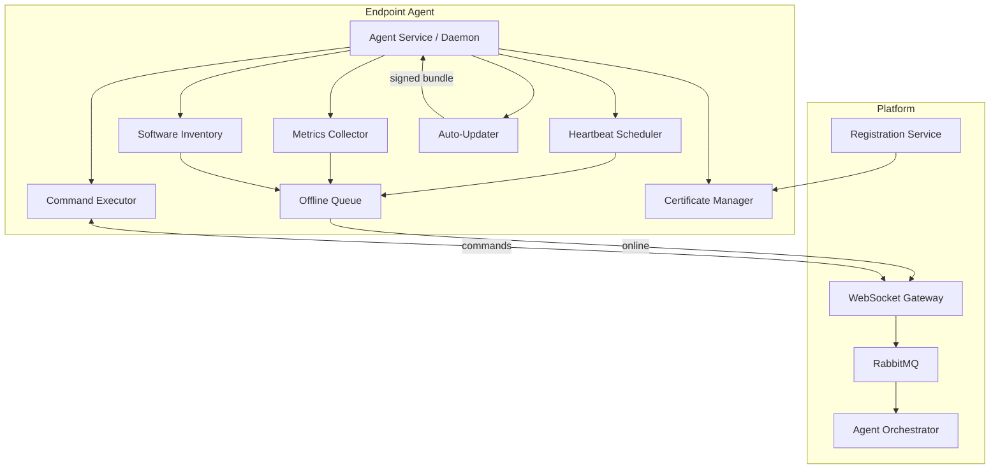
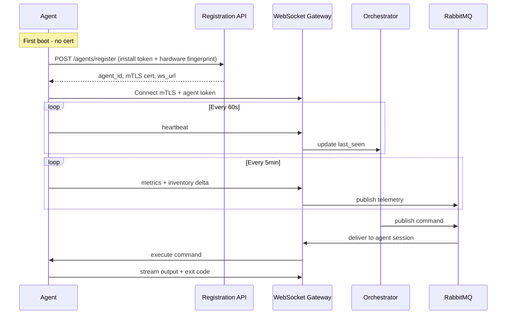
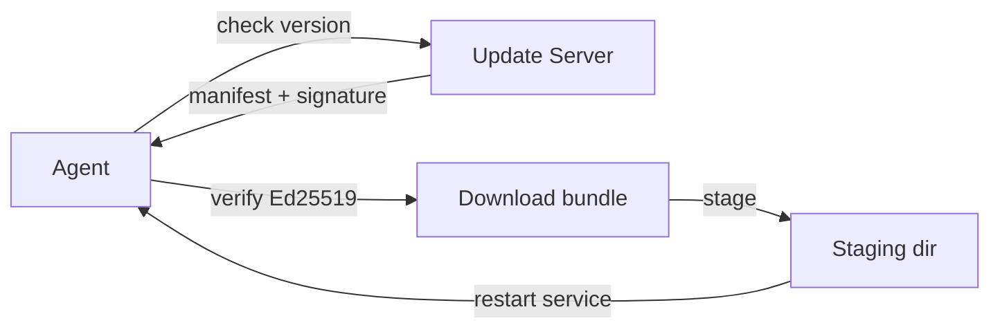

# Agent Architecture

## Overview

Lightweight agents deployed on Windows, Linux, and macOS endpoints collect telemetry, maintain inventory, execute remote commands, and maintain secure bidirectional communication with the platform.

**Design goals:** < 50MB RAM idle, < 1% CPU average, auto-update, offline queue, mTLS auth

---

## Agent Architecture Diagram



---

## Component Design

| Component | Windows | Linux | macOS |
|-----------|---------|-------|-------|
| Runtime | Go binary + Windows Service | Go binary + systemd | Go binary + launchd |
| Metrics | WMI / Performance Counters | /proc, sysinfo | sysctl, IOKit |
| Inventory | Registry + WMI | dpkg/rpm/snap | pkgutil, applications |
| Executor | PowerShell, cmd | bash, ssh | bash, zsh |
| Installer | MSI (WiX) | deb/rpm | pkg |

**Shared core:** `agents/core` — single codebase, OS-specific adapters

---

## Communication Flow



---

## Security Model

### Registration Workflow

1. **Admin generates install token** in portal (scoped to tenant, expires 24h, single/multi use)
2. **Agent installer** embeds token + platform URL
3. **Agent collects hardware fingerprint:** CPU ID, MAC (hashed), hostname, OS serial
4. **Registration API validates token**, creates `agents` + `devices` records
5. **CA issues device certificate** (short-lived, 90 days, auto-renewed)
6. **Agent stores cert** in OS keychain (DPAPI / keyring / Keychain Access)

### Ongoing Security

| Control | Implementation |
|---------|----------------|
| Transport | TLS 1.3 + mTLS |
| Command signing | HMAC-SHA256 with per-agent secret |
| Script allowlist | Tenant-configurable approved script paths |
| Privilege | Runs as SYSTEM/root only when elevated mode enabled |
| Update verification | Ed25519 signed update manifests |
| Revocation | CRL check + instant disconnect on admin revoke |

### Agent Token Payload

```json
{
  "agentId": "uuid",
  "tenantId": "uuid",
  "deviceId": "uuid",
  "permissions": ["metrics", "inventory", "execute"],
  "exp": 1735689600
}
```

---

## Data Collection

### Metrics (every 5 minutes)

```json
{
  "cpuPercent": 23.5,
  "memoryTotalMb": 16384,
  "memoryUsedMb": 11264,
  "disks": [
    { "mount": "C:", "totalGb": 512, "usedGb": 340, "percent": 66.4 }
  ],
  "uptimeSeconds": 864000,
  "networkInterfaces": [
    { "name": "eth0", "ip": "10.0.1.50", "mac": "aa:bb:cc:dd:ee:ff" }
  ]
}
```

### Software Inventory (every 6 hours + on change)

```json
{
  "software": [
    {
      "name": "Google Chrome",
      "version": "125.0.6422.112",
      "publisher": "Google LLC",
      "installDate": "2025-11-01",
      "path": "C:\\Program Files\\Google\\Chrome"
    }
  ],
  "services": [
    { "name": "Spooler", "status": "running", "startType": "automatic" }
  ],
  "antivirus": {
    "product": "Windows Defender",
    "enabled": true,
    "definitionsDate": "2026-06-09",
    "realTimeProtection": true
  },
  "patchStatus": {
    "lastInstalled": "2026-06-01",
    "pendingCount": 3,
    "rebootRequired": false
  }
}
```

---

## Auto-Update



- **Canary rollout:** Platform controls % rollout per tenant
- **Rollback:** Agent keeps previous version for 7 days
- **Bandwidth:** Delta updates where possible

---

## Offline Behavior

- Queue metrics/inventory in SQLite (max 72h / 100MB)
- Flush queue on reconnect (compressed batch)
- Commands queued server-side up to 24h if agent offline

---

## Phase 2 MVP Agent Scope

For demo/pilot, ship **Windows agent only** with:
- Heartbeat
- CPU/memory/disk metrics
- Installed software list
- Windows services list
- Basic PowerShell execution
- Auto-update stub

Linux agent in Phase 2b; macOS in Phase 3.
