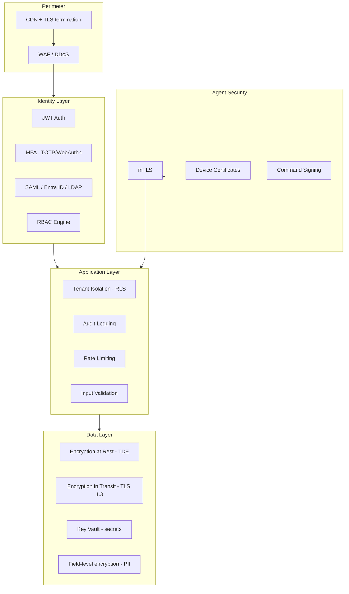

# Security Design

## Security Architecture



---

## RBAC Model

### Permission Format

`{resource}:{action}` — e.g., `asset:read`, `asset:write`, `remote:execute`

### System Roles (Phase 1)

| Role | Permissions | Use Case |
|------|-------------|----------|
| `super_admin` | `*:*` (platform only) | SaaS operator |
| `tenant_admin` | Full tenant access | IT director |
| `it_admin` | assets, employees, devices, remote | IT team |
| `helpdesk` | assets:read, tickets, remote:assist | Support |
| `viewer` | *:read | Read-only stakeholders |

### Custom Roles (Enterprise)

Tenants can create custom roles by selecting permission bundles.

### Enforcement

```typescript
@RequirePermissions('asset:write')
@UseGuards(JwtAuthGuard, TenantGuard, RbacGuard)
@Post()
createAsset(@Body() dto: CreateAssetDto) { ... }
```

---

## MFA

| Method | Phase | Notes |
|--------|-------|-------|
| TOTP (Google Authenticator) | Phase 1 demo | Required for admin roles |
| WebAuthn / FIDO2 | Phase 2 | Hardware keys |
| SMS backup | Phase 3 | Optional, tenant policy |

**Policy:** MFA mandatory for `tenant_admin`, `it_admin`; optional for others.

---

## Zero Trust Principles

1. **Never trust, always verify** — Every API call requires valid JWT + tenant context
2. **Least privilege** — Default deny; permissions explicitly granted
3. **Micro-segmentation** — Services communicate via mTLS in K8s (Istio/Linkerd)
4. **Continuous validation** — Session anomaly detection (new IP, impossible travel)
5. **Device trust** — Agents authenticated independently of user sessions

---

## API Security

| Control | Implementation |
|---------|----------------|
| Authentication | JWT RS256, 15min access token |
| Authorization | RBAC + tenant guard + RLS |
| Input validation | class-validator + whitelist |
| SQL injection | Parameterized queries + ORM |
| XSS | CSP headers, React auto-escape |
| CSRF | SameSite cookies + CSRF token for cookie auth |
| CORS | Whitelist tenant domains |
| Rate limiting | Redis sliding window per tenant/user |
| Request size | 10MB max (100MB for file upload endpoints) |
| Security headers | HSTS, X-Frame-Options, X-Content-Type-Options |

### JWT Structure

```json
{
  "sub": "user-uuid",
  "tenantId": "tenant-uuid",
  "roles": ["it_admin"],
  "permissions": ["asset:read", "asset:write"],
  "iat": 1718000000,
  "exp": 1718000900
}
```

---

## Encryption

### In Transit
- TLS 1.3 minimum for all external traffic
- mTLS for agent ↔ platform
- Internal service mesh mTLS (production)

### At Rest
- Azure PostgreSQL TDE (AES-256)
- Azure Blob SSE for attachments/recordings
- Application-level AES-256-GCM for: MFA secrets, LDAP bind passwords, API keys
- Keys in Azure Key Vault with HSM backing (production)

### Field-Level Encryption

| Field | Encrypted |
|-------|-----------|
| users.mfa_secret | Yes |
| agents.command_secret | Yes |
| alert_channels.webhook_secret | Yes |
| integration credentials | Yes |

---

## Audit Logging

**Logged events:**
- Authentication (login, logout, failed attempts, MFA)
- Authorization failures
- CRUD on assets, employees, users, roles
- Asset assign/return
- Remote command execution (Phase 3+)
- Config changes (alert rules, SSO settings)
- Data export

**Retention:** 1 year default; 7 years for Enterprise (compliance tier)

**Integrity:** Append-only partitions; optional hash chain for Enterprise

---

## Compliance Roadmap

| Standard | Target | Key Controls |
|----------|--------|--------------|
| SOC 2 Type II | Month 18 | Access control, monitoring, change mgmt |
| ISO 27001 | Month 24 | ISMS, risk assessment |
| GDPR | Launch | Data residency, DPA, right to erasure |
| HIPAA | Enterprise add-on | BAA, enhanced audit |

### Data Residency

- EU tenants → Azure West Europe
- US tenants → Azure East US
- Configurable per tenant (Enterprise)

### Tenant Data Deletion

Offboarding workflow: 30-day grace → hard delete all tenant rows → blob purge → audit retention per contract

---

## Security Testing

| Activity | Frequency |
|----------|-----------|
| SAST (CodeQL/Semgrep) | Every PR |
| Dependency scan (Snyk) | Every PR |
| DAST | Weekly staging |
| Penetration test | Annual + major releases |
| Agent binary signing audit | Every agent release |

---

## Incident Response

1. **Detect** — Grafana alerts, App Insights anomalies, WAF blocks
2. **Triage** — On-call engineer, severity classification (P1-P4)
3. **Contain** — Revoke tokens, isolate tenant, block IP/agent
4. **Eradicate** — Patch, rotate secrets
5. **Recover** — Restore from backup if needed
6. **Post-mortem** — Within 5 business days for P1/P2

**RTO:** 4 hours | **RPO:** 1 hour (production)
