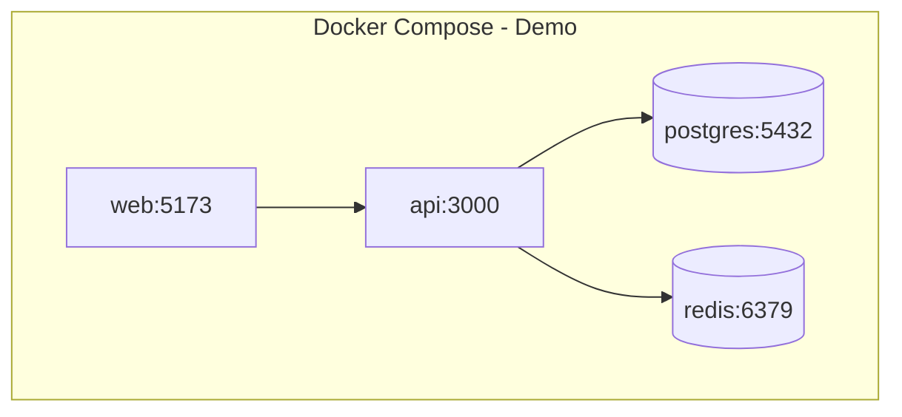
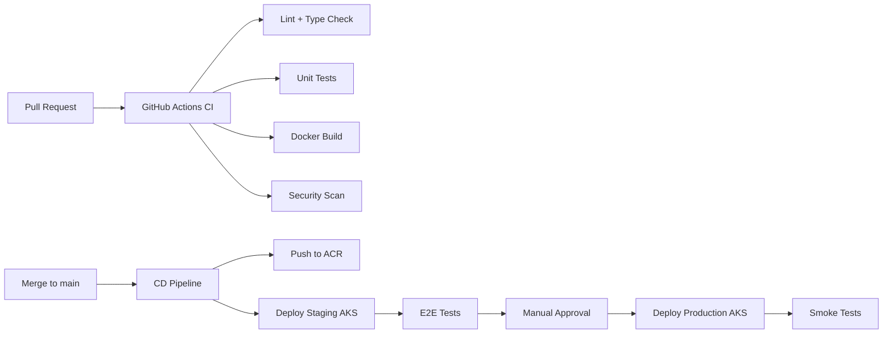
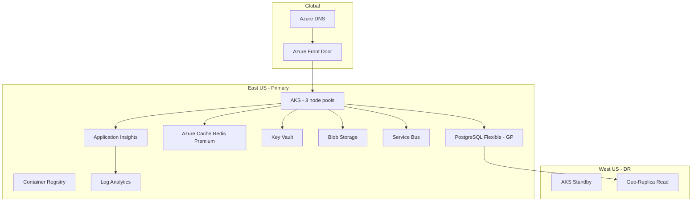

# DevOps Architecture

## Docker Architecture



### Production Containers

| Image | Base | Purpose |
|-------|------|---------|
| `itasset-web` | nginx:alpine + static build | Frontend SPA |
| `itasset-api` | node:20-alpine | NestJS API |
| `itasset-worker` | node:20-alpine | Background jobs (reports, alerts) |
| `itasset-agent-gateway` | node:20-alpine | WebSocket agent gateway (Phase 2) |

---

## Kubernetes Manifests (Production)

```yaml
# Simplified deployment structure
apiVersion: apps/v1
kind: Deployment
metadata:
  name: itasset-api
  namespace: itasset-prod
spec:
  replicas: 3
  selector:
    matchLabels:
      app: itasset-api
  template:
    spec:
      containers:
        - name: api
          image: acr.azurecr.io/itasset-api:v1.0.0
          ports:
            - containerPort: 3000
          envFrom:
            - secretRef:
                name: itasset-api-secrets
            - configMapRef:
                name: itasset-api-config
          resources:
            requests:
              cpu: 250m
              memory: 512Mi
            limits:
              cpu: 1000m
              memory: 1Gi
          livenessProbe:
            httpGet:
              path: /health
              port: 3000
          readinessProbe:
            httpGet:
              path: /health/ready
              port: 3000
```

**K8s resources:**
- Deployments: api (3), web (2), worker (2), agent-gateway (3)
- StatefulSet: none (managed Azure PG/Redis)
- Ingress: nginx-ingress + cert-manager (Let's Encrypt)
- HPA: CPU 70% target, 3-20 replicas
- PDB: minAvailable 2 for api

---

## CI/CD Pipeline



### GitHub Actions — CI (`ci.yml`)

```yaml
name: CI
on:
  pull_request:
    branches: [main, develop]
jobs:
  test:
    runs-on: ubuntu-latest
    services:
      postgres:
        image: postgres:16
        env:
          POSTGRES_PASSWORD: test
        ports: ['5432:5432']
    steps:
      - uses: actions/checkout@v4
      - uses: pnpm/action-setup@v4
      - run: pnpm install --frozen-lockfile
      - run: pnpm lint
      - run: pnpm test
      - run: pnpm build
```

### CD — Staging (auto) / Production (manual gate)

- **Staging:** Auto-deploy on merge to `main`
- **Production:** Tag `v*.*.*` + manual approval
- **Database migrations:** Run as K8s Job before deployment rollout
- **Rollback:** `kubectl rollout undo deployment/itasset-api`

---

## Azure Deployment Architecture



### Azure Resource Sizing (Production Launch)

| Resource | SKU | Notes |
|----------|-----|-------|
| AKS | 3× Standard_D4s_v5 | System + app + agent pools |
| PostgreSQL | GP_Standard_D4s_v3 | 128GB, HA enabled |
| Redis | Premium P1 | 6GB, persistence |
| Blob | Standard GRS | Recordings, exports |
| Front Door | Premium | WAF, global load balancing |

**Estimated monthly cost (launch):** $3,500–$5,000 USD

---

## Backup Strategy

| Data | Method | Frequency | Retention |
|------|--------|-----------|-----------|
| PostgreSQL | Azure automated backup + PITR | Continuous | 35 days |
| PostgreSQL | Weekly logical dump to Blob | Weekly | 1 year |
| Redis | RDB snapshots | Hourly | 7 days |
| Blob storage | GRS replication | Continuous | Per lifecycle policy |
| K8s config | GitOps (Flux/ArgoCD) | Git history | Indefinite |
| Secrets | Key Vault soft-delete | N/A | 90 days |

---

## Disaster Recovery Plan

### RTO / RPO Targets

| Tier | RTO | RPO |
|------|-----|-----|
| Production | 4 hours | 1 hour |
| Staging | 24 hours | 24 hours |

### DR Procedures

1. **Region failure detected** — Front Door health probes fail → route to secondary
2. **Promote geo-replica** — PostgreSQL read replica promoted to primary (manual/automated runbook)
3. **Scale secondary AKS** — Pre-configured standby scaled via Terraform
4. **DNS failover** — Front Door backend pool switch
5. **Validate** — Smoke tests, notify customers via status page

### DR Testing

- **Tabletop exercise:** Quarterly
- **Full failover test:** Semi-annual (staging environment)

---

## Monitoring Stack

| Component | Tool | Alerts |
|-----------|------|--------|
| Infrastructure | Prometheus + node_exporter | CPU, memory, disk |
| Application | App Insights + custom metrics | Error rate, latency p99 |
| Logs | Loki / Log Analytics | Error spikes |
| Dashboards | Grafana | SRE + executive views |
| Uptime | Azure Monitor + external ping | Endpoint availability |

**Critical alerts (PagerDuty):**
- API error rate > 5% for 5 min
- PostgreSQL connection pool exhausted
- Agent gateway disconnect rate > 10%
- Disk usage > 85%

---

## Environment Strategy

| Environment | Purpose | URL pattern |
|-------------|---------|-------------|
| Local | Developer | localhost |
| Demo | Stakeholder demos | demo.platform.com |
| Dev | Integration | dev.platform.com |
| Staging | Pre-prod testing | staging.platform.com |
| Production | Live customers | *.platform.com |
