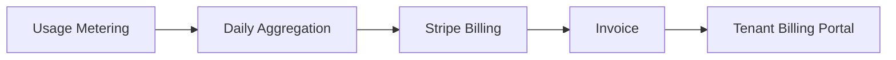

# SaaS Pricing Model

## Pricing Philosophy

- **Per-endpoint pricing** aligns with RMM industry norms (NinjaOne, Action1)
- **Admin seats included** in tiers to reduce friction
- **MSP hierarchy** enables per-client billing without per-client infrastructure
- **Annual discount** drives commitment and improves cash flow

---

## Plan Comparison

| Feature | Starter | Professional | Enterprise | MSP |
|---------|---------|--------------|------------|-----|
| **Price** | $2/endpoint/mo | $4/endpoint/mo | Custom | $3/endpoint/mo* |
| **Min endpoints** | 25 | 50 | 500 | 100 total |
| **Admin seats** | 3 | 15 | Unlimited | Unlimited |
| **Asset management** | ✓ | ✓ | ✓ | ✓ |
| **Endpoint monitoring** | — | ✓ | ✓ | ✓ |
| **Remote management** | — | ✓ | ✓ | ✓ |
| **Network monitoring** | — | Add-on | ✓ | ✓ |
| **Remote desktop** | — | 500 min/mo | Unlimited | 2000 min/mo |
| **Ticketing** | — | Basic | Full ITIL | Full + SLA |
| **Alert channels** | Email | Email, Slack, Teams | All + webhooks | All |
| **SSO (SAML/Entra)** | — | — | ✓ | ✓ |
| **Audit retention** | 90 days | 1 year | 7 years | 1 year |
| **API access** | Read-only | Full | Full + SLA | Full |
| **Support** | Email | Email + chat | Dedicated CSM | Partner portal |
| **White-label** | — | — | Add-on | ✓ |

*MSP pricing is per-endpoint across all client tenants under the MSP account.

---

## Add-Ons

| Add-On | Price | Description |
|--------|-------|-------------|
| Network devices | $1/device/mo | SNMP monitoring for switches/firewalls |
| Remote desktop extra | $0.05/min | Beyond plan allowance |
| Session recording storage | $0.10/GB/mo | Remote desktop recordings |
| Advanced reporting | $99/mo | Custom report builder, scheduled exports |
| AI IT Assistant | $199/mo | Phase 7 — natural language ops |
| Compliance pack | $299/mo | Extended audit, hash chain, compliance reports |
| Professional onboarding | $2,500 one-time | AD integration, migration assistance |

---

## Usage Limits & Overages

| Metric | Starter | Professional | Overage |
|--------|---------|--------------|---------|
| Endpoints | 100 max | 1,000 max | $2/endpoint |
| API calls | 10K/day | 100K/day | $0.01/100 calls |
| Webhook deliveries | 1K/mo | 10K/mo | $0.001/delivery |
| Storage | 5 GB | 50 GB | $0.05/GB |

**Enforcement:** Soft limit at 90% (email warning) → hard limit at 100% (read-only mode for new agent registrations)

---

## Billing Model

- **Billing provider:** Stripe Billing (subscriptions + usage records)
- **Billing cycle:** Monthly or annual (15% discount)
- **Trial:** 14 days, Professional features, 50 endpoint limit
- **MSP billing:** Consolidated invoice with per-client line items (usage export)

---

## Revenue Projections (Illustrative)

| Year | Tenants | Avg Endpoints | ARPU/mo | ARR |
|------|---------|---------------|---------|-----|
| Y1 | 50 | 150 | $450 | $270K |
| Y2 | 300 | 200 | $600 | $2.16M |
| Y3 | 2,000 | 250 | $750 | $18M |

---

## Competitive Positioning

| Vendor | Entry Price | Our Advantage |
|--------|-------------|---------------|
| NinjaOne | ~$4/endpoint | Unified asset + ticket + network |
| Lansweeper | ~$2/asset | Real-time monitoring + remote |
| Action1 | Free tier + paid | Enterprise SSO, MSP hierarchy |
| ManageEngine | Complex licensing | Modern UX, cloud-native, simpler pricing |

---

## Phase 1 Demo Pricing Slide (For Stakeholders)

**Recommended launch pricing:**
- Starter: **$2/endpoint/month** (annual: $1.70)
- Professional: **$4/endpoint/month** (annual: $3.40)
- 14-day free trial, no credit card for demo environment

**Break-even estimate:** ~400 endpoints on Professional plan covers $3.5K/mo Azure infrastructure.
