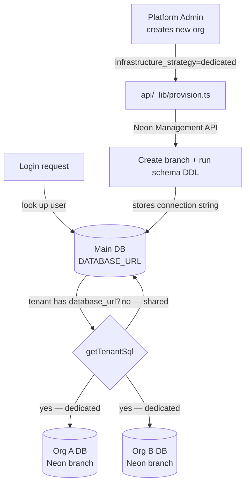

# Database-per-Tenant Architecture

Assetly supports two multi-tenancy modes in the same codebase — **shared database** (default) and **dedicated database per tenant** — with zero changes to individual API routes.

---

## Overview



---

## Two Modes

| Mode | `tenants.database_url` | Isolation level | When to use |
|---|---|---|---|
| **Shared** (default) | `NULL` — uses `DATABASE_URL` | Logical (tenant_id filter) | Starter / SMB plans |
| **Dedicated** | Neon branch connection string | Physical (separate DB) | Enterprise / compliance |

Both modes use identical query code. `getTenantSql(tenantId)` routes each request transparently.

---

## How Routing Works

**File: `api/_lib/db.ts`**

```
Login JWT issued
      │
      ▼
  API request arrives
      │
      ▼
getTenantSql(auth.tenantId)
      │
      ├── cache hit? ──────────────► return cached client
      │
      └── cache miss
            │
            ▼
        SELECT database_url FROM tenants WHERE id = ?
            │
            ├── database_url IS NOT NULL ──► neon(database_url) ──► tenant's own DB
            │
            └── database_url IS NULL ───────► neon(DATABASE_URL) ──► shared DB
```

Results are cached in a module-level `Map` per Vercel edge instance — so the main-DB lookup only happens once per tenant per cold start.

---

## Provisioning a New Organisation

### Automatic (Neon API — recommended for production)

When `NEON_API_KEY` and `NEON_PROJECT_ID` are set, creating an organisation with `infrastructure_strategy: "dedicated"` via the System Admin UI or API:

1. Calls **Neon Management API** → creates a new branch named `tenant-{slug}`
2. Runs all tenant schema DDL on the new branch (`api/_lib/provision.ts`)
3. Stores the returned connection string in `tenants.database_url`

The org's data is now completely isolated in its own Neon branch.

```
POST /api/tenants
{
  "name": "Acme Corp",
  "slug": "acme",
  "infrastructure_strategy": "dedicated"
}
```

Response includes the newly created tenant. If provisioning fails the request returns a `500` with the Neon error — no partial state is saved.

### Manual (bring your own DB)

If `NEON_API_KEY` is not configured, you can still use a dedicated DB by:

1. Manually creating a Neon branch (or any PostgreSQL database)
2. Running the tenant schema:

```bash
psql "postgresql://..." -f database/supabase/001_assetly_schema.sql
psql "postgresql://..." -f database/supabase/004_asset_requests.sql
psql "postgresql://..." -f database/supabase/005_users_and_tenants.sql
# + any endpoint security migrations
```

3. Updating the tenant record:

```sql
UPDATE tenants
SET database_url = 'postgresql://...'
WHERE slug = 'acme';
```

---

## Schema Design in Dedicated DBs

Dedicated tenant databases contain **only tenant-scoped tables** — no platform tables (`tenants`, `users`, `user_passwords`). The `tenant_id` column is kept as a plain `UUID` with no foreign key constraint (since there is no `tenants` table in the org DB). All existing `WHERE tenant_id = ?` queries work unchanged.

| Table | In main DB | In tenant DB |
|---|---|---|
| `tenants` | ✅ | ❌ |
| `users` | ✅ | ❌ |
| `user_passwords` | ✅ | ❌ |
| `assets` | ✅ (shared mode) | ✅ (dedicated mode) |
| `employees` | ✅ (shared mode) | ✅ (dedicated mode) |
| `departments` | ✅ (shared mode) | ✅ (dedicated mode) |
| `vendors` | ✅ (shared mode) | ✅ (dedicated mode) |
| `endpoints` | ✅ (shared mode) | ✅ (dedicated mode) |
| `audit_logs` | ✅ (shared mode) | ✅ (dedicated mode) |
| `asset_requests` | ✅ (shared mode) | ✅ (dedicated mode) |
| `hr_leave_requests` | ✅ (shared mode) | ✅ (dedicated mode) |

---

## Environment Variables

| Variable | Required for | Description |
|---|---|---|
| `DATABASE_URL` | Always | Main/shared PostgreSQL connection string |
| `NEON_API_KEY` | Auto-provisioning | Neon personal access token |
| `NEON_PROJECT_ID` | Auto-provisioning | Neon project to create branches in |

Get `NEON_API_KEY` from: **Neon Console → Account Settings → API Keys**  
Get `NEON_PROJECT_ID` from: **Neon Console → Project → Settings**

---

## Security Properties

- An authenticated user's `tenantId` comes from their **signed JWT** — it cannot be forged
- `getTenantSql` resolves the DB from the server-side `tenants` table — the client never specifies a connection string
- In dedicated mode, a misconfigured or compromised tenant JWT **cannot reach another tenant's DB** because the connection strings are different PostgreSQL endpoints
- The main DB (`DATABASE_URL`) is only queried for: tenant metadata, user lookup, and password verification

---

## Cost Considerations (Neon)

| Plan | Branches | Recommended use |
|---|---|---|
| Neon Free | Up to 10 branches | Dev / small pilots |
| Neon Launch ($19/mo) | Unlimited branches | Up to ~50 dedicated tenants |
| Neon Scale ($69/mo) | Unlimited branches + more compute | Production MSP deployments |

Each Neon branch shares compute with the parent project (no extra compute cost per branch) but has isolated storage.

---

## Related Files

| File | Purpose |
|---|---|
| [`api/_lib/db.ts`](../api/_lib/db.ts) | `getTenantSql()` router with module cache |
| [`api/_lib/provision.ts`](../api/_lib/provision.ts) | Neon branch creation + schema DDL |
| [`api/tenants/index.ts`](../api/tenants/index.ts) | Tenant creation → calls `provisionTenantDatabase` |
| [`database/supabase/007_tenant_database_url.sql`](../database/supabase/007_tenant_database_url.sql) | Migration: adds `database_url` column to `tenants` |
